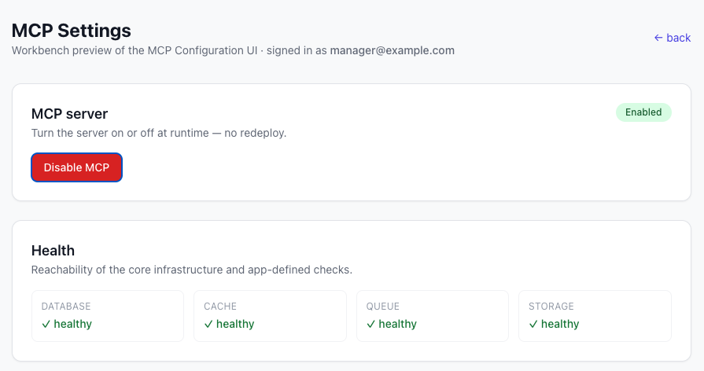
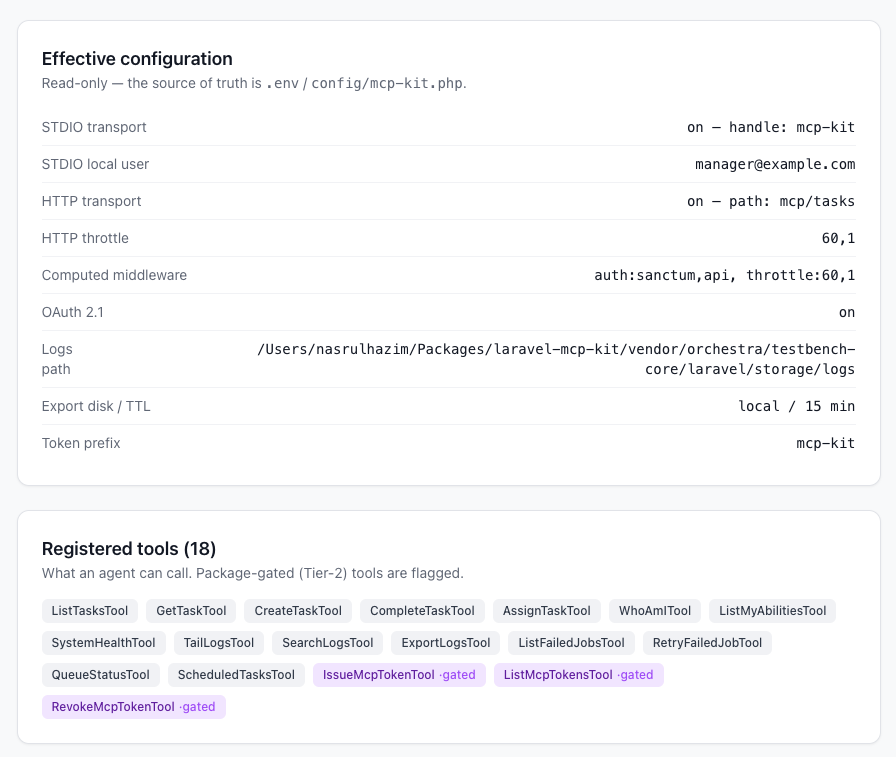
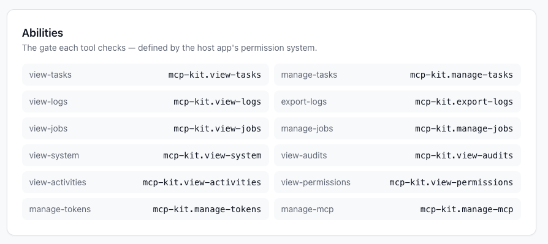

# Laravel MCP Kit

[](https://packagist.org/packages/cleaniquecoders/laravel-mcp-kit)
[](https://github.com/cleaniquecoders/laravel-mcp-kit/actions/workflows/run-tests.yml)
[](LICENSE.md)
[](https://packagist.org/packages/cleaniquecoders/laravel-mcp-kit)
[](https://packagist.org/packages/cleaniquecoders/laravel-mcp-kit)

A **reusable starter package** for adding a Model Context Protocol (MCP) server to your Laravel
projects, built on the official [`laravel/mcp`](https://github.com/laravel/mcp) package. It ships a
small task-management domain as a working reference and gives you, ready to copy or extend, the
patterns a production MCP server needs.

## Features

- **Tools** (read + write), **Resources** (read-by-URI context), and **Prompts** (reusable templates)
- **A generic ops toolbox** — `whoami`/abilities, `system_health`, logs (tail/search/export),
  failed-jobs + queue + scheduler, and — when the packages are present — audits, MCP token management,
  RBAC, and activity. [See the catalogue.](docs/02-architecture/03-generic-toolbox.md)
- **Opt-in by presence** — Tier-2 tools auto-register only when their backing package (and table) exist
- **Per-tool authorization** via Gate abilities — MCP is a third UI, never a back door
- **uuid-only** inputs/outputs — the internal auto-increment id never leaks to the agent
- **Write tools funnel through Action classes** — the agent, web UI, and CLI share one rule set
- **STDIO** (local) and **Streamable HTTP** (remote) transports
- **Two HTTP auth methods** — Sanctum personal access tokens *and* OAuth 2.1 (Passport) — on one endpoint
- **Honest annotations** (`#[IsReadOnly]`) so clients know which tools change state and gate them
- **A runtime on/off toggle**, a **`mcp-kit:doctor`** wiring check, and **gate-first generators**
  (`mcp-kit:make-tool` / `make-resource` / `make-prompt`)

## Preview

A workbench preview of the MCP settings UI ([#16](https://github.com/cleaniquecoders/laravel-mcp-kit/issues/16)) —
flip the runtime toggle and review system health, the effective config, and the live tool registry, all
gated on `manage-mcp`. Run it with `composer serve`, then open `/mcp` (see [Workbench](docs/05-development/01-workbench.md)).





## Requirements

- PHP 8.4+
- Laravel 11, 12, or 13
- `laravel/mcp` ^0.8

## Installation

```bash
composer require cleaniquecoders/laravel-mcp-kit
php artisan mcp-kit:install   # publishes config + migration (add --oauth to wire OAuth 2.1)
php artisan migrate
```

## Abilities

Every tool checks a Gate ability. The kit ships the ability **names** (in `config('mcp-kit.abilities')`);
your app decides who holds each, mapping them onto its permission system (`Gate::define`, a Policy, or
spatie/laravel-permission) — see [Installation](docs/01-getting-started/01-installation.md). `whoami` and
`list_my_abilities` need only an authenticated user.



## Quick Start

```bash
php artisan mcp-kit:demo                          # seed demo tasks
claude mcp add mcp-kit -- php artisan mcp:start mcp-kit   # connect over STDIO
```

Set `MCP_KIT_LOCAL_USER` to the email the local transport should act as. See
[Quick Start](docs/01-getting-started/02-quick-start.md) for HTTP and OAuth.

## Documentation

Full documentation lives in [`docs/`](docs/README.md):

| Section | Contents |
|---|---|
| [Getting Started](docs/01-getting-started/README.md) | Installation, gates, first call |
| [Architecture](docs/02-architecture/README.md) | What the server exposes and the conventions |
| [Authentication](docs/03-authentication/README.md) | Connecting clients; Sanctum and OAuth 2.1 |
| [Configuration](docs/04-configuration/README.md) | `config/mcp-kit.php` and `MCP_KIT_*` reference |
| [Development](docs/05-development/README.md) | Testbench Workbench and testing |
| [Deployment](docs/06-deployment/README.md) | Running the OAuth transport in production |

## Testing

```bash
composer test
```

## Changelog

See [CHANGELOG.md](CHANGELOG.md) for recent changes.

## License

MIT. © Nasrul Hazim / CleaniqueCoders. See [LICENSE.md](LICENSE.md).
